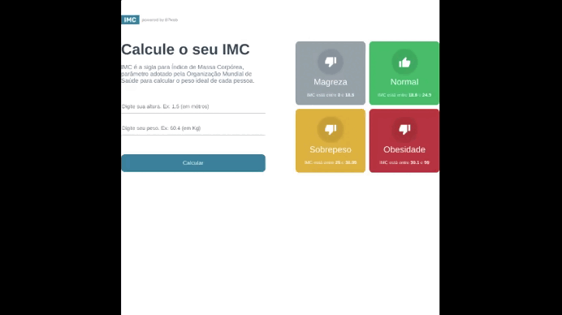

# Calculadora de IMC

<h1 align="center">
	
</h1>

Projeto em React, fazendo uma calculadora de IMC.

Atividade desenvolvida durante o curso B7Web.

# Tecnologias

- [ReactJS](https://pt-br.reactjs.org/)
- [ViteJS](https://vitejs.dev/)

### Intalação

- `npm install`

### Para rodar

- `npm run dev`
